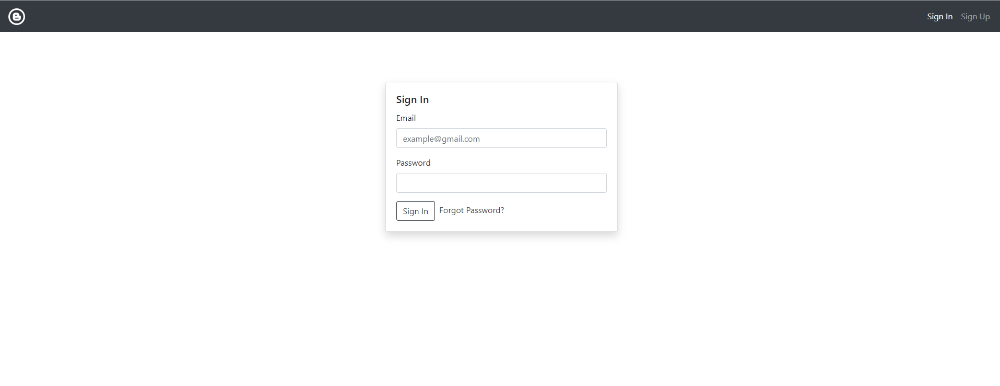
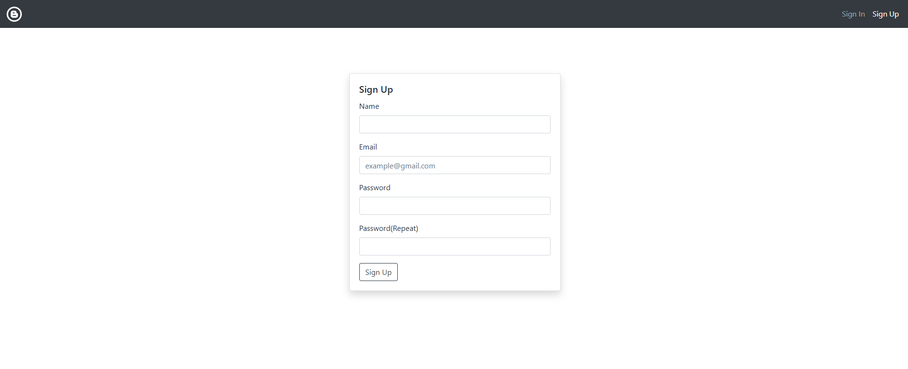
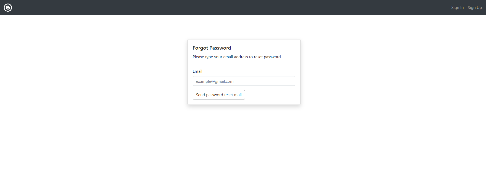
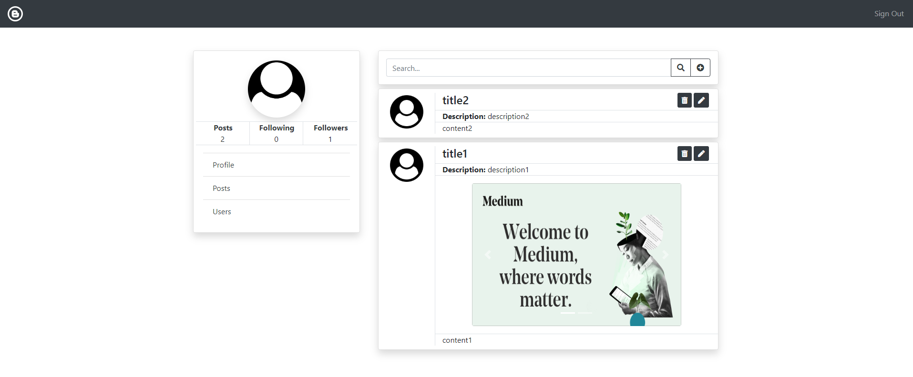
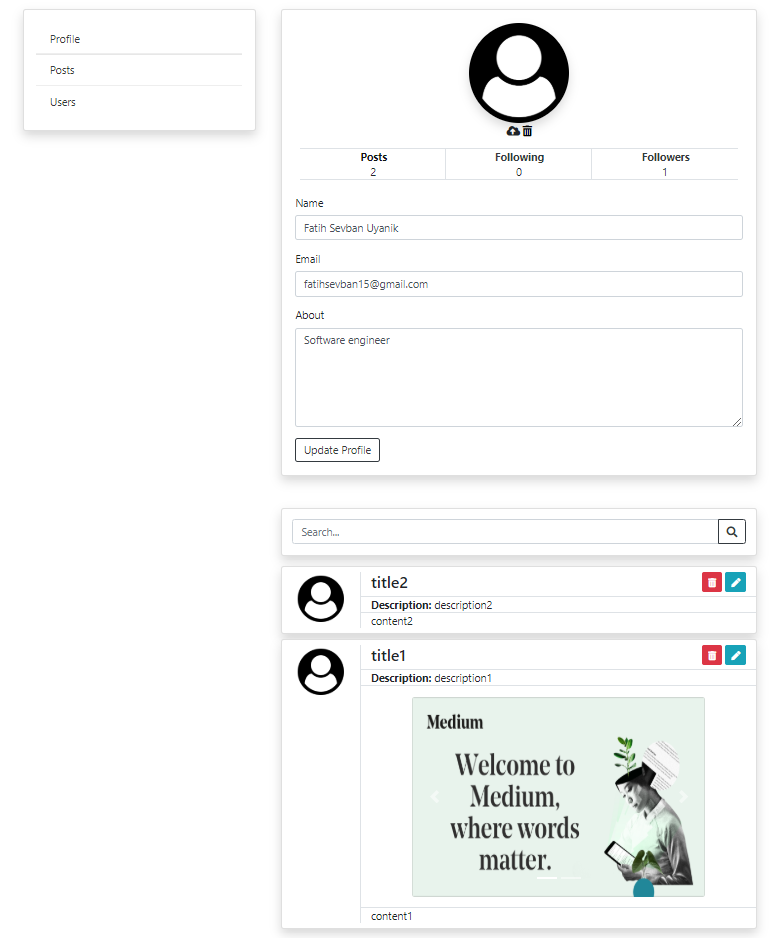
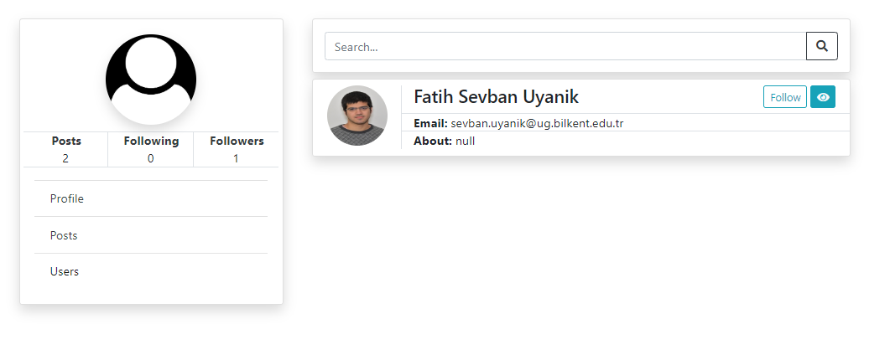
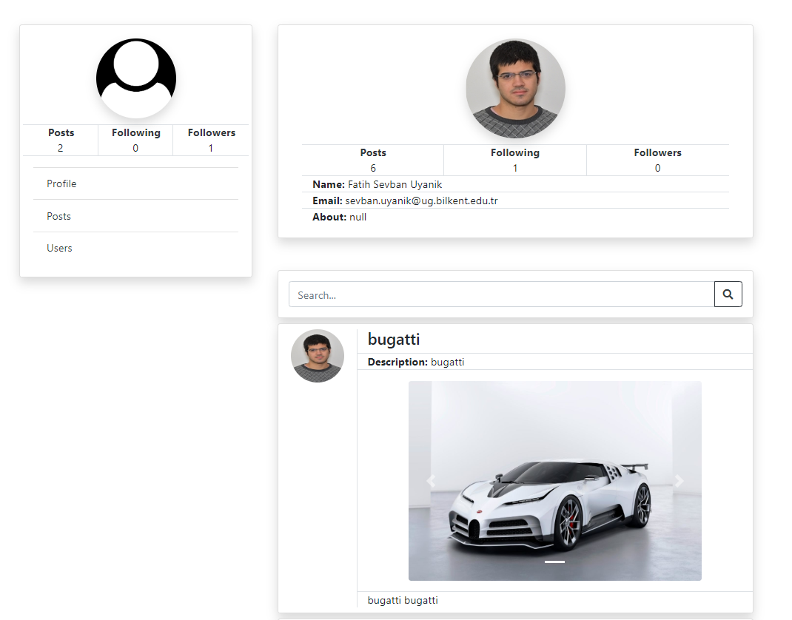

# Blogger-App

## Project setup
```
npm install
```

### Compiles and hot-reloads for development
```
npm run serve
```

### Compiles and minifies for production
```
npm run build
```

## Blogger-App
Blogger is a social media application that enables users to share their images and blog posts.  
This project is the frontend part and developed with VueJS, Vuex, VeeValidate, VueRouter, Toastr, Bootstrap and axios.
Http requests are made with axious to the backend which is written in laravel and the data is shown with VueJS. The followings 
are sample screenshots of the application:
<br>


<hr>

<hr>

<hr>

<hr>

<hr>

<hr>

